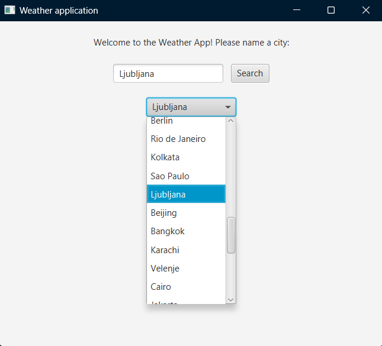
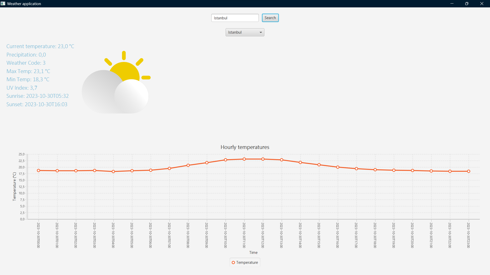

# Weather Appplication (WeatherAppFX)

Is a simple JavaFX application that provides weather information for various cities around the world. It uses data from a weather API to display current conditions, daily forecasts, and hourly temperature charts.

## Features

- Search for weather by city name.
- Select a city from a dropdown menu.
- View current temperature, precipitation, and more.
- Visualize hourly temperature trends.

## How to Use

1. Clone the repository.
2. Open the project in your preferred IDE.
3. Build and run the application.
4. We'll update this part once I finish and package the final build.

## Screenshots

## Dependencies

- OpenWeatherMap API
- JavaFX

## Acknowledgements

Special thanks to [Open-meteo](https://open-meteo.com/) for providing the weather data used in this application.

## License

[MIT License](LICENSE)
